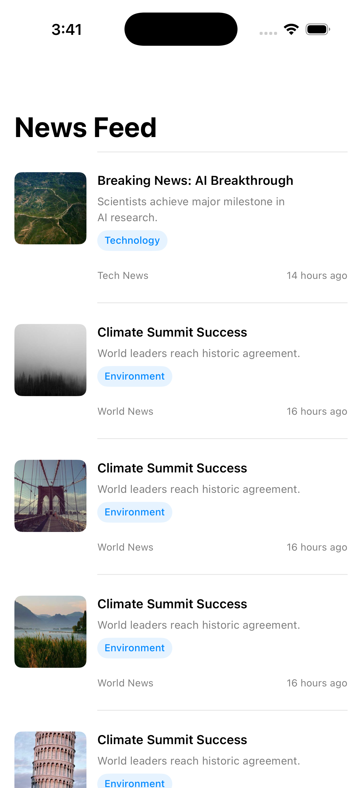
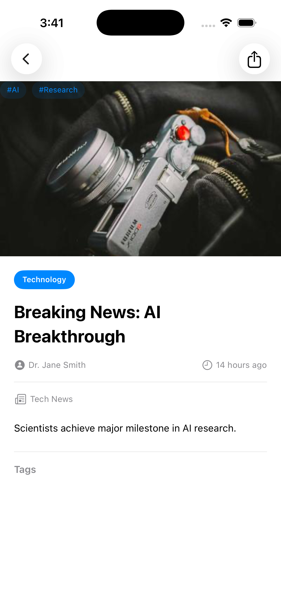

# AutoPlayFeed 📰

A modern iOS news feed application built with SwiftUI and Clean Architecture principles. Browse the latest news articles with infinite scrolling, detailed views, and a beautiful native iOS experience.

## Features

- 📱 **Native SwiftUI Interface** - Built entirely with SwiftUI for a smooth, native iOS experience
- ∞ **Infinite Scrolling** - Seamlessly load more articles as you scroll
- 🖼️ **Rich Media** - Display article images with async loading and error handling
- 📖 **Detailed Article View** - Read full article content with metadata, tags, and sharing options
- 🔄 **Pull to Refresh** - Refresh the feed with a simple pull-down gesture
- 🏗️ **Clean Architecture** - Well-organized codebase following SOLID principles
- ✅ **Comprehensive Testing** - Unit and integration tests for all layers
- 🎨 **SwiftUI Previews** - Rapid development with Xcode Previews for all views

## Screenshots

<!-- TODO: Add screenshots here -->
> **Note**: To add screenshots, run the app in the iOS Simulator, capture the following screens, and replace the placeholders below:
> 1. News Feed List - Main view showing article list
> 2. Article Detail - Detail view of a selected article
> 3. Loading State - Feed in loading state
> 4. Error State - Error view with retry button

### News Feed
<p align="center">
  
</p>

*News feed displaying articles with title, description, image, and metadata*

### Article Detail
<p align="center">
  
</p>

*Detailed article view with full content, author information, and tags*

## Architecture

The app follows **Clean Architecture** principles with clear separation of concerns across four distinct layers:

```
┌─────────────────────────────────────────┐
│         Presentation Layer              │
│  (Views, ViewModels, Router, Builder)   │
└──────────────┬──────────────────────────┘
               │
┌──────────────▼──────────────────────────┐
│           Domain Layer                   │
│    (Models, UseCases, Protocols)        │
└──────────────┬──────────────────────────┘
               │
┌──────────────▼──────────────────────────┐
│            Data Layer                    │
│  (Repository, API, DTOs, Adapters)      │
└──────────────┬──────────────────────────┘
               │
┌──────────────▼──────────────────────────┐
│       Infrastructure Layer               │
│    (Network, DI Container, Config)      │
└─────────────────────────────────────────┘
```

### Layer Responsibilities

#### 📱 Presentation Layer
- **Views**: SwiftUI views (`NewsFeedView`, `NewsDetailView`, `NewsItemRowView`)
- **ViewModels**: State management with `@MainActor` isolation
- **Router**: Navigation management using `NavigationPath`
- **Builder**: Dependency injection and view composition

#### 🎯 Domain Layer
- **Models**: Core business entities (`NewsItem`, `NewsPageResponse`)
- **Use Cases**: Business logic (`NewsUseCaseProtocol`)
- **Adapters**: Data transformation between layers
- **Errors**: Domain-specific error types

#### 💾 Data Layer
- **Repository**: Data access abstraction (`NewsRepositoryProtocol`)
- **API**: Network endpoint definitions (`NewsAPI`)
- **DTOs**: Data transfer objects with `Codable` conformance
- **Adapters**: Map DTOs to domain models

#### ⚙️ Infrastructure Layer
- **Network Service**: Generic async/await HTTP client
- **DI Container**: Dependency injection and lifecycle management
- **Endpoints**: URL and request configuration

## Technical Stack

- **Language**: Swift 5.9+
- **UI Framework**: SwiftUI
- **Concurrency**: Swift Concurrency (async/await, actors)
- **Architecture**: Clean Architecture + MVVM
- **Dependency Injection**: Protocol-based DI with DIContainer
- **Testing**: Swift Testing framework
- **Minimum iOS**: iOS 17.0+

## Project Structure

```
autoplayfeed/
├── autoplayfeed/                      # Main app target
│   ├── App/
│   │   ├── autoplayfeedApp.swift      # App entry point
│   │   └── AppComposition.swift        # Root composition
│   ├── Infrastructure/
│   │   ├── DI/
│   │   │   └── DIContainer.swift       # Dependency container
│   │   └── Network/
│   │       ├── NetworkService.swift    # Network protocols
│   │       └── URLSessionNetworkService.swift
│   ├── Data/
│   │   ├── API/
│   │   │   └── NewsAPI.swift           # API endpoints
│   │   ├── DTOs/
│   │   │   ├── NewsItemDTO.swift
│   │   │   └── NewsPageResponseDTO.swift
│   │   └── Repositories/
│   │       ├── NewsRepositoryProtocol.swift
│   │       └── NewsRepository.swift
│   ├── Domain/
│   │   ├── Models/
│   │   │   ├── NewsItem.swift
│   │   │   └── NewsPageResponse.swift
│   │   ├── UseCases/
│   │   │   ├── NewsUseCaseProtocol.swift
│   │   │   └── NewsUseCase.swift
│   │   ├── Adapters/
│   │   │   └── NewsItemAdapter.swift
│   │   └── Errors/
│   │       └── NewsError.swift
│   ├── Presentation/
│   │   ├── Common/
│   │   │   ├── LoadingView.swift
│   │   │   └── ErrorView.swift
│   │   └── NewsFeed/
│   │       ├── Views/
│   │       │   ├── NewsFeedView.swift
│   │       │   ├── NewsDetailView.swift
│   │       │   └── NewsItemRowView.swift
│   │       ├── ViewModels/
│   │       │   └── NewsFeedViewModel.swift
│   │       ├── Router/
│   │       │   ├── NewsFeedRouterProtocol.swift
│   │       │   └── NewsFeedRouter.swift
│   │       └── Builder/
│   │           └── NewsFeedBuilder.swift
│   ├── Preview/
│   │   └── DevPreview.swift            # Preview helpers
│   └── Assets.xcassets/
├── autoplayfeedTests/                  # Unit tests
│   ├── NewsRepositoryTests.swift
│   ├── NewsUseCaseTests.swift
│   └── autoplayfeedTests.swift
└── autoplayfeedUITests/                # UI tests
    ├── autoplayfeedUITests.swift
    └── autoplayfeedUITestsLaunchTests.swift
```

## Getting Started

### Prerequisites

- Xcode 15.0 or later
- iOS 17.0+ Simulator or Device
- macOS 14.0 (Sonoma) or later

### Installation

1. Clone the repository:
```bash
git clone https://github.com/obadasemary/autoplayfeed.git
cd autoplayfeed
```

2. Open the project in Xcode:
```bash
open autoplayfeed.xcodeproj
```

3. Build and run:
   - Select a simulator or device from the scheme menu
   - Press `Cmd + R` to build and run
   - Or use the command line:
```bash
xcodebuild -project autoplayfeed.xcodeproj -scheme autoplayfeed -configuration Debug build
```

### Running Tests

Run all tests:
```bash
xcodebuild -project autoplayfeed.xcodeproj -scheme autoplayfeed test
```

Run only unit tests:
```bash
xcodebuild -project autoplayfeed.xcodeproj -scheme autoplayfeed -only-testing:autoplayfeedTests test
```

Run only UI tests:
```bash
xcodebuild -project autoplayfeed.xcodeproj -scheme autoplayfeed -only-testing:autoplayfeedUITests test
```

## Key Features Implementation

### Infinite Scrolling
The app implements efficient pagination by detecting when the last item appears in the list:
```swift
.onAppear {
    if item == items.last {
        viewModel.loadMore()
    }
}
```

### Pull to Refresh
Native SwiftUI refresh control:
```swift
.refreshable {
    await viewModel.refresh()
}
```

### Navigation
Type-safe navigation using `NavigationPath` and enum-based destinations:
```swift
enum NewsFeedDestination: Hashable {
    case newsDetail(NewsItemAdapter)
}
```

### State Management
Clean state representation with `@MainActor` isolation:
```swift
enum NewsFeedViewState {
    case idle
    case loading
    case loaded([NewsItemAdapter])
    case loadingMore([NewsItemAdapter])
    case error(NewsError)
}
```

## Testing Strategy

The project includes comprehensive test coverage:

- **Unit Tests**: Test business logic in isolation using mock implementations
- **Integration Tests**: Verify layer integration and data flow
- **UI Tests**: Validate user interface and user flows (planned)

### Mock Implementations
All protocols have mock implementations for testing:
- `MockNewsRepository`: Simulates API responses
- `MockNewsUseCase`: Tests view model logic
- Preview providers for rapid UI development

## Code Quality

- ✅ **Swift Concurrency**: Full async/await implementation
- ✅ **Actor Isolation**: Proper `@MainActor` usage for UI safety
- ✅ **Sendable Conformance**: Thread-safe data models
- ✅ **Protocol-Oriented**: Testable and flexible architecture
- ✅ **Type Safety**: Strong typing with Swift's type system
- ✅ **Error Handling**: Comprehensive error handling patterns

## Development Workflow

The project includes Claude Code skills for enhanced development:
- **SwiftUI Expert**: Guidance on SwiftUI best practices
- **Swift Concurrency**: Expertise on async/await and actors

See [CLAUDE.md](CLAUDE.md) for detailed development instructions.

## Future Enhancements

- [ ] Bookmark/favorite articles
- [ ] Search and filter functionality
- [ ] Dark mode support
- [ ] Offline reading with local cache
- [ ] Share articles to social media
- [ ] Push notifications for breaking news
- [ ] Category filtering
- [ ] Multiple news sources

## Contributing

Contributions are welcome! Please feel free to submit a Pull Request. For major changes, please open an issue first to discuss what you would like to change.

1. Fork the repository
2. Create your feature branch (`git checkout -b feature/AmazingFeature`)
3. Commit your changes (`git commit -m 'Add some AmazingFeature'`)
4. Push to the branch (`git push origin feature/AmazingFeature`)
5. Open a Pull Request

## License

This project is available under the MIT License. See the LICENSE file for more info.

## Acknowledgments

- Built with ❤️ using SwiftUI
- News data provided by [News API](https://newsapi.org/)
- Architecture inspired by Clean Architecture principles by Robert C. Martin

## Contact

Obada Semary - [@obadasemary](https://github.com/obadasemary)

Project Link: [https://github.com/obadasemary/autoplayfeed](https://github.com/obadasemary/autoplayfeed)

---

**Note**: This is a demonstration project showcasing Clean Architecture implementation in SwiftUI. The API used may have rate limits for free tier usage.
